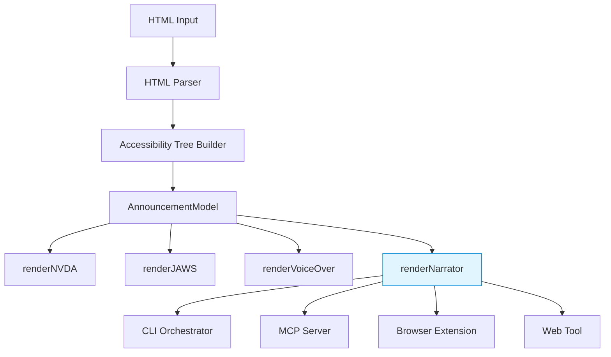

# Design Document: Narrator Renderer

## Overview

This design adds a Windows Narrator screen reader renderer to the Speakable accessibility analysis tool. The Narrator renderer follows the identical architectural pattern established by the existing NVDA, JAWS, and VoiceOver renderers: a standalone TypeScript module at `src/renderer/narrator-renderer.ts` that exports a `renderNarrator` function accepting an `AnnouncementModel` and optional `colorize` boolean, returning multi-line announcement text.

Windows Narrator uses distinct conventions compared to the other three screen readers:
- **Role-first ordering** for links, headings, and landmarks (similar to VoiceOver)
- **Name-first ordering** for buttons and other interactive controls (similar to NVDA/JAWS)
- **Unique state vocabulary**: "unchecked" (not "not checked"), "partially selected" (not "half checked"/"mixed"), "disabled" (not "unavailable"/"dimmed")
- **Simplified landmark roles**: "navigation" without "landmark" or "region" suffix (unlike NVDA's "navigation landmark" or JAWS's "navigation region")
- **"content info"** for the `contentinfo` role (with a space, unlike other renderers)

The renderer integrates into all four existing consumption points: CLI orchestrator, MCP server, browser extension, and web tool.

## Architecture



The architecture is a simple pipeline:
1. HTML → Parse → Extract → `AnnouncementModel` (existing, unchanged)
2. `AnnouncementModel` → `renderNarrator()` → announcement text (new)
3. Integration points route to `renderNarrator` when "narrator" is selected (updates to existing code)

The `AnnouncementModel` is the stable interface between extraction and rendering. The Narrator renderer reads the model but never modifies it, maintaining the same pure-function pattern as the other renderers.

## Components and Interfaces

### Primary Component: `src/renderer/narrator-renderer.ts`

```typescript
import type { AccessibleNode, AccessibleRole, AnnouncementModel } from '../model/types.js';
import { createColors, type ColorFunctions } from '../cli/colors.js';

/**
 * Renders an announcement model as Narrator-style announcement text.
 */
export function renderNarrator(model: AnnouncementModel, colorize?: boolean): string;
```

**Internal functions** (not exported):

```typescript
/** Recursively renders a node and its children. */
function renderNodeNarrator(node: AccessibleNode, announcements: string[], c: ColorFunctions): void;

/** Formats a single node as a Narrator announcement. */
function formatNodeNarrator(node: AccessibleNode, c: ColorFunctions): string;

/** Returns the Narrator role text for a node. */
function formatRoleNarrator(node: AccessibleNode): string;

/** Returns the Narrator state text for a node. */
function formatStatesNarrator(node: AccessibleNode): string;

/** Determines if the role should be announced before the name. */
function shouldAnnounceRoleFirst(role: AccessibleRole): boolean;
```

### Role Mapping: `narratorRole`

| AccessibleRole | Narrator Role Text |
|---|---|
| `button` | `"button"` |
| `link` | `"link"` |
| `heading` (level N) | `"Heading level N"` |
| `textbox` | `"edit"` |
| `checkbox` | `"check box"` |
| `radio` | `"radio button"` |
| `combobox` | `"combo box"` |
| `listbox` | `"list box"` |
| `option` | `"option"` |
| `list` | `"list"` |
| `listitem` | `"list item"` |
| `navigation` | `"navigation"` |
| `main` | `"main"` |
| `banner` | `"banner"` |
| `contentinfo` | `"content info"` |
| `complementary` | `"complementary"` |
| `form` | `"form"` |
| `search` | `"search"` |
| `region` | `"region"` |
| `img` | `"image"` |
| `article` | `"article"` |
| `table` | `"table, N rows, N columns"` |
| `row` | `"row"` |
| `columnheader` | `"column header"` |
| `rowheader` | `"row header"` |
| `figure` | `"figure"` |
| `dialog` | `"dialog"` |
| `meter` | `"meter"` |
| `progressbar` | `"progress bar"` |
| `status` | `"status"` |
| `group` (named) | `"group"` |
| `group` (unnamed) | `""` |
| `document` | `"document"` |
| `application` | `"application"` |
| `separator` | `"separator"` |
| `blockquote` | `"block quote"` |
| `code` | `"code"` |
| `generic` | `""` |
| `staticText` | `""` |
| `paragraph` | `""` |
| `cell` | `""` |
| `term` | `""` |
| `definition` | `""` |
| `caption` | `""` |

### State Mapping: `narratorStates`

| State Condition | Narrator State Text |
|---|---|
| `checked === true` | `"checked"` |
| `checked === false` | `"unchecked"` |
| `checked === 'mixed'` | `"partially selected"` |
| `expanded === true` | `"expanded"` |
| `expanded === false` | `"collapsed"` |
| `pressed === true` | `"pressed"` |
| `pressed === false` | `"not pressed"` |
| `pressed === 'mixed'` | `"partially pressed"` |
| `selected === true` | `"selected"` |
| `selected === false` | `"not selected"` |
| `disabled === true` | `"disabled"` |
| `invalid === true` | `"invalid"` |
| `required === true` | `"required"` |
| `readonly === true` | `"read only"` |
| `busy === true` | `"busy"` |
| `current === 'page'` | `"current page"` |
| `current === 'step'` | `"current step"` |
| `current === 'location'` | `"current location"` |
| `current === 'date'` | `"current date"` |
| `current === 'time'` | `"current time"` |
| `current === 'true'` | `"current"` |
| `grabbed === true` | `"grabbed"` |
| `grabbed === false` | `"not grabbed"` |

### Announcement Ordering Algorithm

The ordering algorithm determines whether the role is announced before or after the name, based on the node's role:

```typescript
function shouldAnnounceRoleFirst(role: AccessibleRole): boolean {
  // Role-first: links, headings, landmarks, structural containers
  const roleFirstRoles: AccessibleRole[] = [
    'link',
    'heading',
    'navigation',
    'main',
    'banner',
    'contentinfo',
    'complementary',
    'region',
    'form',
    'search',
    'blockquote',
    'figure',
    'dialog',
    'group',
    'document',
  ];
  return roleFirstRoles.includes(role);
}
```

**Announcement assembly order:**

For **role-first** nodes (links, headings, landmarks):
```
[role], [name], [state], [value], [description]
```
Example: `"link, Home"`, `"Heading level 2, Section Title"`, `"navigation, Main Menu"`

For **name-first** nodes (buttons, controls, everything else):
```
[name], [role], [state], [value], [description]
```
Example: `"Submit, button"`, `"Email, edit, required"`, `"Accept, check box, unchecked"`

### Integration Points

#### CLI Orchestrator (`src/cli/orchestrator.ts`)

Changes:
1. Import `renderNarrator` from `./renderer/narrator-renderer.js`
2. Update `ScreenReader` type in `src/cli/options.ts` to: `'nvda' | 'jaws' | 'voiceover' | 'narrator' | 'all'`
3. Add `case 'narrator': return renderNarrator(model, colorize);` to the switch in `formatScreenReaderOutput`
4. In the `'all'` branch, add Narrator with `c.sectionHeader('=== Narrator ===')` header

#### MCP Server (`src/mcp.ts`)

Changes:
1. Import `renderNarrator` from `./renderer/narrator-renderer.js`
2. Update `ScreenReader` type alias to include `'narrator'`
3. Update the `z.enum()` for `screen_reader` to include `'narrator'`
4. Add `case 'narrator': return renderNarrator(model);` in the `renderOutput` switch
5. In the `'all'` branch, add `'--- Narrator ---'` section with `renderNarrator(model)` output
6. Update the tool description string to mention Narrator

#### Browser Extension (`extension/analyzer-bridge.js`)

Changes:
1. Add `narratorRole(n)` function mapping roles to Narrator text (mirrors the TypeScript `formatRoleNarrator`)
2. Add `narratorStates(s)` function mapping states to Narrator text (mirrors `formatStatesNarrator`)
3. In `renderNode`, add an `else if (renderer === 'narrator')` branch implementing role-first/name-first ordering
4. In the `'all'` branch of `SpeakableAnalyzer.analyze`, add `=== Narrator ===` section

#### Web Tool (`site/`)

Changes:
1. Add `"narrator"` to the screen reader dropdown options
2. Pass `"narrator"` to the analysis function when selected
3. In "all" mode, display Narrator output alongside the other three

### Renderer Index (`src/renderer/index.ts`)

Add re-export:
```typescript
export * from './narrator-renderer.js';
```

## Data Models

No new data models are introduced. The Narrator renderer consumes the existing `AnnouncementModel` interface (defined in `src/model/types.ts`) which contains:

- `version: ModelVersion` — schema version for compatibility
- `root: AccessibleNode` — the accessibility tree root
- `metadata` — extraction timestamp and source hash

The `AccessibleNode` tree structure provides all information needed for rendering:
- `role: AccessibleRole` — determines role text and ordering
- `name: string` — the accessible name
- `description?: string` — accessible description
- `value?: AccessibleValue` — form control values
- `state: AccessibleState` — all ARIA states
- `focus: FocusInfo` — focusability (not used by renderers)
- `children: AccessibleNode[]` — child nodes for recursion

## Correctness Properties

*A property is a characteristic or behavior that should hold true across all valid executions of a system — essentially, a formal statement about what the system should do. Properties serve as the bridge between human-readable specifications and machine-verifiable correctness guarantees.*

### Property 1: Colorize toggle determines ANSI presence

*For any* valid AnnouncementModel, rendering with `colorize=true` SHALL produce output containing ANSI escape sequences, and rendering with `colorize=false` (or omitted) SHALL produce output containing no ANSI escape sequences.

**Validates: Requirements 1.2, 1.3**

### Property 2: Role text mapping correctness

*For any* AccessibleNode with a recognized role, the Narrator role text segment in the rendered output SHALL exactly match the defined `narratorRole` mapping for that role (e.g., "button" → "button", "link" → "link", "navigation" → "navigation" without "landmark"/"region" suffix, "contentinfo" → "content info", "img" → "image").

**Validates: Requirements 2.1, 2.2, 2.3, 2.4, 2.5, 2.6, 2.7, 2.8, 2.9, 2.10, 2.11, 2.12, 2.13, 2.14, 2.15, 2.16, 2.17, 2.18, 2.19, 2.20, 2.21**

### Property 3: State text mapping correctness

*For any* AccessibleNode with one or more state properties set, the rendered Narrator state text SHALL contain exactly the state strings defined in the `narratorStates` mapping (e.g., checked=true → "checked", checked=false → "unchecked", checked="mixed" → "partially selected", disabled=true → "disabled").

**Validates: Requirements 3.1, 3.2, 3.3, 3.4, 3.5, 3.6, 3.7, 3.8, 3.9, 3.10, 3.11, 3.12, 3.13, 3.14, 3.15, 3.16**

### Property 4: Announcement ordering follows role-based rules

*For any* AccessibleNode with both a non-empty name and a non-empty role text, if the node's role is in the role-first set (link, heading, landmarks, blockquote, figure, dialog, group, document) then the role text SHALL appear before the name in the output line; otherwise the name SHALL appear before the role text.

**Validates: Requirements 4.1, 4.2, 4.3, 4.4**

### Property 5: Redundant single-child collapsing

*For any* AccessibleNode tree where a parent has exactly one child and that child shares the same name as the parent, the rendered output SHALL NOT contain duplicate consecutive announcements for the parent and child — instead, it SHALL skip the child and recurse into grandchildren.

**Validates: Requirements 1.5**

### Property 6: Output format consistency

*For any* valid AnnouncementModel, each non-empty line in the rendered Narrator output SHALL consist of comma-separated segments where each segment is one of: a name string, a recognized Narrator role text, a recognized Narrator state text, a value string, or a description string.

**Validates: Requirements 10.6**

## Error Handling

The Narrator renderer is a pure transformation from an in-memory model to a string. It does not perform I/O, network calls, or fallible operations. Error handling is minimal:

1. **Empty/null model**: If `model.root` has no renderable content, return an empty string (matches behavior of other renderers).
2. **Unknown roles**: If a role is not in the mapping, fall through to returning the role string as-is (same as NVDA/JAWS/VoiceOver renderers' `default` case).
3. **Missing name/states**: Each segment is only added if non-empty; missing fields result in shorter announcement lines, not errors.
4. **Integration point errors**: The CLI, MCP, and extension catch errors at their own boundaries. The renderer itself does not throw.

## Testing Strategy

### Unit Tests (`tests/unit/renderer/narrator-renderer.test.ts`)

Example-based tests following the same structure as `nvda-renderer.test.ts`:
- Button announcements (name-first ordering, states)
- Link announcements (role-first ordering, states)
- Heading announcements (with levels)
- Landmark announcements (all landmark roles, no suffix)
- Form control announcements (textbox, checkbox, radio, combobox)
- State announcements (all state variations)
- Nested structure traversal
- Redundant child collapsing
- Colorize on/off

### Property-Based Tests (`tests/unit/renderer/narrator-renderer.property.test.ts`)

Using `fast-check` (already available in the project's test dependencies via vitest):

- **Property 1**: Generate random AnnouncementModels, render with colorize true/false, assert ANSI presence/absence
- **Property 2**: Generate random AccessibleNodes with known roles, render, verify role text matches mapping
- **Property 3**: Generate random AccessibleNodes with random state combinations, render, verify state text matches mapping
- **Property 4**: Generate random nodes with names + roles, verify ordering matches role-first/name-first rules
- **Property 5**: Generate trees with single-child same-name patterns, verify no duplicate announcements
- **Property 6**: Generate random valid models, render, verify all output lines match the expected segment format

Each property test runs a minimum of 100 iterations. Each test is tagged with:
```
// Feature: narrator-renderer, Property N: <property_text>
```

### Integration Tests

- CLI: verify `--screen-reader narrator` produces Narrator output
- CLI: verify `--screen-reader all` includes `=== Narrator ===` section
- MCP: verify `screen_reader: "narrator"` works end-to-end
- Extension: verify `renderNode(node, 'narrator')` produces correct output
