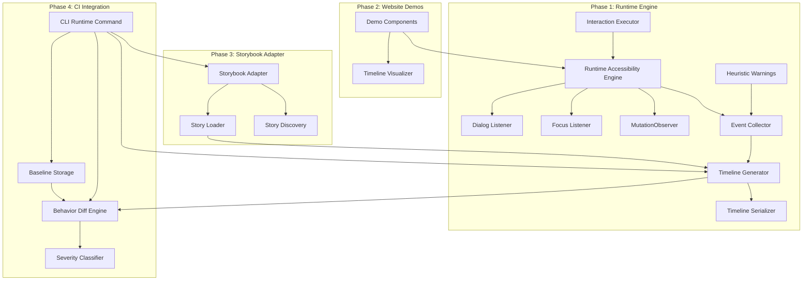

# Design Document: Runtime Accessibility Timeline

## Overview

This design extends `@reticular/speakable` from static HTML analysis to runtime accessibility behavior observation. The core addition is a Runtime Accessibility Engine that attaches to a browser document (via jsdom or a real browser iframe), installs MutationObservers and event listeners for accessibility-relevant changes, and produces normalized Accessibility Event sequences called Timelines.

The system follows the existing module pattern: self-contained directories under `src/` with clear type boundaries, deterministic serialization, and programmatic APIs exposed through `src/index.ts`.

**Phased delivery:**

- Phase 1 (this design's primary focus): Runtime Accessibility Engine, event types, timeline generation, interaction sequences, built-in patterns, heuristic warnings, and timeline format. Standalone, no Storybook dependency.
- Phase 2: Website demo components on getspeakable.dev showcasing timelines visually.
- Phase 3: Storybook Adapter for story discovery and iframe loading.
- Phase 4: Behavior Diff Engine, baseline storage, severity classification, CI/CD integration, and CLI `runtime` command.

## Architecture



**Key architectural decisions:**

1. **jsdom for Phase 1**: The Runtime Accessibility Engine operates on jsdom documents in Phase 1. This allows the engine to work in Node.js without a headless browser, matching Speakable's current architecture. Phase 3 introduces real browser iframes via Storybook.

2. **Event-driven collection**: The engine uses MutationObserver for DOM mutations, focus/blur listeners for focus tracking, and synthetic event dispatching for interaction simulation. Events flow through a single EventCollector that timestamps and normalizes them.

3. **Deterministic serialization**: Following the pattern in `src/model/serialization.ts`, all timeline output uses sorted keys and 2-space indentation for stable diffs in version control.

4. **Module independence**: Each phase adds new modules under `src/` without modifying existing modules. Phase 1 adds `src/runtime/`, Phase 3 adds `src/storybook/`, Phase 4 extends `src/diff/` and `src/cli/`.

## Components and Interfaces

### Phase 1 Components

#### RuntimeAccessibilityEngine

The central observer that attaches to a document and emits accessibility events.

```typescript
// src/runtime/engine.ts

export interface EngineOptions {
  /** Document to observe */
  document: Document;
  /** Whether to enable heuristic warnings (default: true) */
  heuristics?: boolean;
  /** Custom settle time in ms (default: 100) */
  settleTime?: number;
}

export interface RuntimeAccessibilityEngine {
  /** Attach observers to the document and begin event collection */
  attach(): void;
  /** Detach all observers and stop collection */
  detach(): void;
  /** Get all collected events since attach */
  getEvents(): AccessibilityEvent[];
  /** Clear collected events without detaching */
  reset(): void;
  /** Whether the engine is currently attached */
  readonly isAttached: boolean;
}

export function createEngine(options: EngineOptions): RuntimeAccessibilityEngine;
```

#### AccessibilityEvent (Type System)

```typescript
// src/runtime/types.ts

export type EventType =
  | 'FOCUS_CHANGED'
  | 'ANNOUNCEMENT'
  | 'DOM_MUTATION'
  | 'ROLE_CHANGED'
  | 'ACCESSIBLE_NAME_CHANGED'
  | 'STATE_CHANGED'
  | 'KEYBOARD_ACTION'
  | 'DIALOG_OPENED'
  | 'DIALOG_CLOSED'
  | 'WARNING'
  | 'REGRESSION';

export interface EventTarget {
  /** ARIA role of the target element */
  role: string;
  /** Computed accessible name */
  accessibleName: string;
  /** Stable CSS selector path for element identification */
  selector: string;
}

export interface AccessibilityEvent {
  /** Event classification */
  type: EventType;
  /** Milliseconds elapsed since session start */
  timestamp: number;
  /** Target element information */
  target: EventTarget;
  /** Type-specific payload data */
  payload: EventPayload;
}

export type EventPayload =
  | FocusChangedPayload
  | AnnouncementPayload
  | RoleChangedPayload
  | AccessibleNameChangedPayload
  | StateChangedPayload
  | DialogOpenedPayload
  | DialogClosedPayload
  | KeyboardActionPayload
  | WarningPayload;

export interface FocusChangedPayload {
  kind: 'focus_changed';
  previousTarget: EventTarget | null;
}

export interface AnnouncementPayload {
  kind: 'announcement';
  politeness: 'polite' | 'assertive';
  text: string;
}

export interface RoleChangedPayload {
  kind: 'role_changed';
  previousRole: string;
  newRole: string;
}

export interface AccessibleNameChangedPayload {
  kind: 'accessible_name_changed';
  previousName: string;
  newName: string;
}

export interface StateChangedPayload {
  kind: 'state_changed';
  attribute: string;
  previousValue: string | boolean | null;
  newValue: string | boolean | null;
}

export interface DialogOpenedPayload {
  kind: 'dialog_opened';
  dialogName: string;
  isModal: boolean;
}

export interface DialogClosedPayload {
  kind: 'dialog_closed';
  dialogName: string;
}

export interface KeyboardActionPayload {
  kind: 'keyboard_action';
  key: string;
  modifiers: string[];
}

export interface WarningPayload {
  kind: 'warning';
  message: string;
  relatedEvent?: AccessibilityEvent;
}
```

#### TimelineGenerator

Orchestrates interaction sessions and produces complete timelines.

```typescript
// src/runtime/timeline-generator.ts

export interface TimelineGeneratorOptions {
  /** Document or iframe to attach to */
  document: Document;
  /** Component name for metadata */
  componentName: string;
  /** Story or variant name for metadata */
  storyName?: string;
  /** Settle period after last action (default: 500ms) */
  settlePeriod?: number;
  /** Maximum wait for document load (default: 10000ms) */
  loadTimeout?: number;
  /** Enable heuristic warnings (default: true) */
  heuristics?: boolean;
}

export interface AccessibilityTimeline {
  version: string;
  component: string;
  story: string | null;
  interactionSequence: string;
  duration: number;
  events: AccessibilityEvent[];
  warnings: AccessibilityEvent[];
  metadata: TimelineMetadata;
}

export interface TimelineMetadata {
  capturedAt: string;
  speakableVersion: string;
  sourceUrl: string;
  userAgent: string;
}

export function createTimelineGenerator(
  options: TimelineGeneratorOptions
): TimelineGenerator;

export interface TimelineGenerator {
  /** Execute an interaction sequence and produce a timeline */
  capture(sequence: InteractionSequence): Promise<AccessibilityTimeline>;
  /** Abort an in-progress capture */
  abort(): void;
}
```

#### InteractionSequence

```typescript
// src/runtime/interactions.ts

export type InteractionAction =
  | { type: 'click'; selector: string }
  | { type: 'tab' }
  | { type: 'shiftTab' }
  | { type: 'escape' }
  | { type: 'enter' }
  | { type: 'space' }
  | { type: 'arrowUp' }
  | { type: 'arrowDown' }
  | { type: 'arrowLeft' }
  | { type: 'arrowRight' }
  | { type: 'key'; combo: string }
  | { type: 'wait'; ms: number };

export interface InteractionSequence {
  /** Human-readable description of the interaction */
  description: string;
  /** Ordered list of actions to perform */
  actions: InteractionAction[];
}

export function serializeInteractionSequence(seq: InteractionSequence): string;
export function deserializeInteractionSequence(json: string): InteractionSequence;
```

#### Built-in Interaction Patterns

```typescript
// src/runtime/patterns.ts

export interface PatternSelectorMap {
  trigger?: string;
  container?: string;
  content?: string;
  items?: string;
  input?: string;
}

export type BuiltinPatternName =
  | 'modal-dialog'
  | 'combobox'
  | 'tabs'
  | 'accordion';

export function getBuiltinPattern(
  name: BuiltinPatternName,
  selectors?: PatternSelectorMap
): InteractionSequence;
```

#### Heuristic Warnings Module

```typescript
// src/runtime/heuristics.ts

export interface HeuristicConfig {
  /** Time window to detect focus moving into dialog (default: 100ms) */
  dialogFocusTimeout: number;
  /** Time window to detect rapid announcements (default: 500ms) */
  rapidAnnouncementWindow: number;
  /** Threshold for rapid announcement count (default: 3) */
  rapidAnnouncementThreshold: number;
  /** Time window to detect keyboard action response (default: 200ms) */
  keyboardResponseTimeout: number;
}

export function createHeuristicAnalyzer(
  config?: Partial<HeuristicConfig>
): HeuristicAnalyzer;

export interface HeuristicAnalyzer {
  /** Process an event and return any warnings it triggers */
  process(event: AccessibilityEvent): AccessibilityEvent[];
  /** Get current open dialog state (for focus escape detection) */
  readonly openDialogs: string[];
}
```

#### Timeline Serialization

```typescript
// src/runtime/serialization.ts

export function serializeTimeline(timeline: AccessibilityTimeline): string;
export function deserializeTimeline(json: string): AccessibilityTimeline;
export function timelinesEqual(a: AccessibilityTimeline, b: AccessibilityTimeline): boolean;

export function serializeEvent(event: AccessibilityEvent): string;
export function deserializeEvent(json: string): AccessibilityEvent;
```

### Phase 3 Components (Storybook Adapter)

```typescript
// src/storybook/adapter.ts

export interface StorybookAdapterOptions {
  url: string;
  componentFilter?: string;
  viewport?: { width: number; height: number };
}

export interface StoryInfo {
  id: string;
  componentName: string;
  storyName: string;
  hasPlayFunction: boolean;
}

export interface StorybookAdapter {
  connect(): Promise<void>;
  discoverStories(): Promise<StoryInfo[]>;
  loadStory(storyId: string): Promise<Document>;
  disconnect(): void;
}
```

### Phase 4 Components (Diff and CI)

```typescript
// src/runtime/diff-engine.ts

export interface BehaviorDiffReport {
  baseline: { totalEvents: number };
  current: { totalEvents: number };
  added: DiffEntry[];
  removed: DiffEntry[];
  modified: DiffEntry[];
  summary: {
    totalBaseline: number;
    totalCurrent: number;
    added: number;
    removed: number;
    modified: number;
  };
}

export interface DiffEntry {
  event: AccessibilityEvent;
  severity: SeverityLevel;
  message: string;
}

export type SeverityLevel = 'critical' | 'high' | 'medium' | 'low';

export function diffTimelines(
  baseline: AccessibilityTimeline,
  current: AccessibilityTimeline
): BehaviorDiffReport;
```

## Data Models

### AccessibilityEvent Schema

Each event follows this JSON structure (sorted keys, 2-space indentation):

```json
{
  "payload": {
    "kind": "focus_changed",
    "previousTarget": {
      "accessibleName": "Submit",
      "role": "button",
      "selector": "form > button[type=submit]"
    }
  },
  "target": {
    "accessibleName": "Cancel",
    "role": "button",
    "selector": "form > button.cancel"
  },
  "timestamp": 1250,
  "type": "FOCUS_CHANGED"
}
```

### AccessibilityTimeline Schema

```json
{
  "component": "LoginForm",
  "duration": 3200,
  "events": [],
  "interactionSequence": "Tab through form fields and submit",
  "metadata": {
    "capturedAt": "2024-01-15T10:30:00.000Z",
    "sourceUrl": "http://localhost:6006/iframe.html?id=loginform--default",
    "speakableVersion": "1.3.0",
    "userAgent": "jsdom/23.0.0"
  },
  "story": "Default",
  "version": "1.0",
  "warnings": []
}
```

### InteractionSequence Schema

```json
{
  "actions": [
    { "selector": "button.trigger", "type": "click" },
    { "type": "tab" },
    { "type": "tab" },
    { "type": "escape" }
  ],
  "description": "Open dialog, tab through content, close with escape"
}
```

### Baseline File Schema (Phase 4)

```json
{
  "baseline": {
    "createdAt": "2024-01-15T10:30:00.000Z",
    "interactionSequence": "modal-dialog",
    "speakableVersion": "1.3.0",
    "storybookUrl": "http://localhost:6006"
  },
  "timeline": { }
}
```

### Directory Structure

```
src/
├── runtime/
│   ├── index.ts              # Public API exports
│   ├── types.ts              # Event types, timeline types
│   ├── engine.ts             # RuntimeAccessibilityEngine
│   ├── timeline-generator.ts # TimelineGenerator
│   ├── interactions.ts       # InteractionSequence types + serialization
│   ├── patterns.ts           # Built-in interaction patterns
│   ├── heuristics.ts         # Heuristic warning analyzer
│   ├── serialization.ts      # Timeline/event serialization
│   ├── selector.ts           # Stable CSS selector generation
│   └── observers/
│       ├── focus-observer.ts
│       ├── mutation-observer.ts
│       ├── dialog-observer.ts
│       └── live-region-observer.ts
├── storybook/               # Phase 3
│   ├── index.ts
│   ├── adapter.ts
│   ├── discovery.ts
│   └── loader.ts
└── (existing modules unchanged)
```

## Correctness Properties

*A property is a characteristic or behavior that should hold true across all valid executions of a system: a formal statement about what the system should do. Properties serve as the bridge between human-readable specifications and machine-verifiable correctness guarantees.*

### Property 1: Event serialization round-trip

*For any* valid AccessibilityEvent object, serializing to JSON and then deserializing SHALL produce an object deeply equal to the original.

**Validates: Requirements 2.4**

### Property 2: Timeline serialization byte-identical round-trip

*For any* valid AccessibilityTimeline object, serializing to JSON, deserializing, then re-serializing SHALL produce a byte-identical string to the first serialization.

**Validates: Requirements 3.7, 14.7**

### Property 3: Deterministic event serialization

*For any* valid AccessibilityEvent object, calling the serializer twice SHALL produce byte-identical output strings with sorted keys and 2-space indentation.

**Validates: Requirements 2.3, 2.5**

### Property 4: Deterministic timeline serialization

*For any* valid AccessibilityTimeline object, calling the serializer twice SHALL produce byte-identical output strings with sorted keys and 2-space indentation.

**Validates: Requirements 3.6, 14.6**

### Property 5: Monotonically increasing timestamps

*For any* sequence of AccessibilityEvents collected by a single RuntimeAccessibilityEngine session, each event's timestamp SHALL be greater than or equal to the previous event's timestamp (events are in chronological order).

**Validates: Requirements 1.9, 14.3**

### Property 6: InteractionSequence serialization round-trip

*For any* valid InteractionSequence object, serializing then deserializing SHALL produce an equivalent object.

**Validates: Requirements 6.7**

### Property 7: Behavior diff event accounting

*For any* two valid AccessibilityTimelines, the BehaviorDiffReport summary counts SHALL equal the lengths of the corresponding arrays (summary.added == added.length, summary.removed == removed.length, summary.modified == modified.length).

**Validates: Requirements 8.7**

### Property 8: Stable CSS selector uniqueness

*For any* element in a document that has a generated stable CSS selector, querying the document with that selector SHALL return exactly one element (the original target).

**Validates: Requirements 2.2**

### Property 9: Timeline warnings subset

*For any* valid AccessibilityTimeline, every event in the `warnings` array SHALL also appear in the `events` array with type "WARNING", and every event in `events` with type "WARNING" SHALL appear in the `warnings` array.

**Validates: Requirements 14.4**

### Property 10: Diff timestamp invariance

*For any* two AccessibilityTimelines that differ only in their event timestamps (same event types, same targets, same payloads in the same order), the BehaviorDiffReport SHALL report zero added, zero removed, and zero modified entries (or classify all changes as low severity with no structural differences).

**Validates: Requirements 8.6, 9.7**

## Error Handling

### Phase 1 Errors

| Condition | Behavior | Exit Code (CLI) |
|-----------|----------|-----------------|
| Document has no body | Return error with descriptive message | 2 |
| Document load timeout (>10s) | Abort session, return URL and failure reason | 2 |
| `click(selector)` target not found | Emit WARNING event, continue sequence | N/A |
| MutationObserver not available | Throw `EngineUnsupportedError` | 3 |
| Invalid InteractionSequence JSON | Throw `InteractionParseError` with details | 2 |

### Phase 3 Errors

| Condition | Behavior | Exit Code (CLI) |
|-----------|----------|-----------------|
| Storybook URL unreachable | Return error with URL and connection details | 2 |
| Stories index not found | Return error indicating version may be unsupported | 2 |
| Story iframe load timeout (>10s) | Return error with story ID and failure reason | 2 |

### Phase 4 Errors

| Condition | Behavior | Exit Code (CLI) |
|-----------|----------|-----------------|
| Baseline directory not writable | Print error to stderr | 3 |
| Critical/high severity regressions | Report to stdout | 1 |
| Medium/low regressions (default) | Report to stdout | 0 |
| Medium+ regressions with `--runtime-fail-on medium` | Report to stdout | 1 |

Error types follow the existing `ParsingError` pattern: custom error classes that extend `Error` with structured metadata for programmatic handling.

## Testing Strategy

### Property-Based Testing

This feature is well-suited to property-based testing. The serialization layer, event normalization, diff algorithm, and timeline structure all have universal properties that should hold across generated inputs.

**Library**: `fast-check` (already in devDependencies)
**Minimum iterations**: 100 per property
**Tag format**: `Feature: runtime-accessibility-timeline, Property {number}: {property_text}`

Properties to implement as PBT:
- Property 1 (event round-trip)
- Property 2 (timeline round-trip)
- Property 3 (deterministic event serialization)
- Property 4 (deterministic timeline serialization)
- Property 5 (monotonically increasing timestamps)
- Property 6 (interaction sequence round-trip)
- Property 7 (diff event accounting)
- Property 8 (selector uniqueness)
- Property 9 (warnings subset)
- Property 10 (diff timestamp invariance)

### Unit Testing

Example-based unit tests for:
- Each event type emission (focus, announcement, role change, name change, state change, dialog open/close, keyboard action)
- Each heuristic warning trigger condition
- Built-in interaction patterns produce expected action sequences
- Severity classification for specific regression scenarios
- CLI argument parsing for runtime flags
- Storybook stories index parsing (7.x and 8.x formats)

### Integration Testing

- Full timeline capture with jsdom document and multi-step interaction sequence
- Baseline save/load/compare cycle
- CLI `runtime` command end-to-end with a local HTML file
- Storybook adapter connecting to a mock Storybook server (Phase 3)

### Test File Organization

```
src/runtime/__tests__/
├── engine.test.ts
├── engine.property.test.ts
├── timeline-generator.test.ts
├── interactions.test.ts
├── interactions.property.test.ts
├── serialization.property.test.ts
├── heuristics.test.ts
├── patterns.test.ts
├── selector.test.ts
├── selector.property.test.ts
└── diff-engine.property.test.ts   # Phase 4
```
