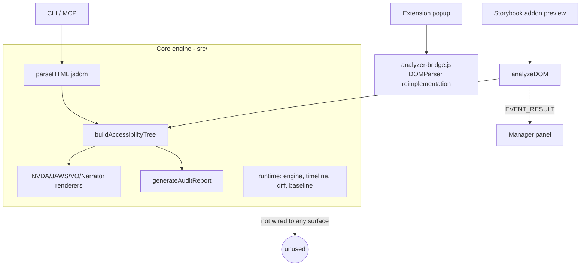
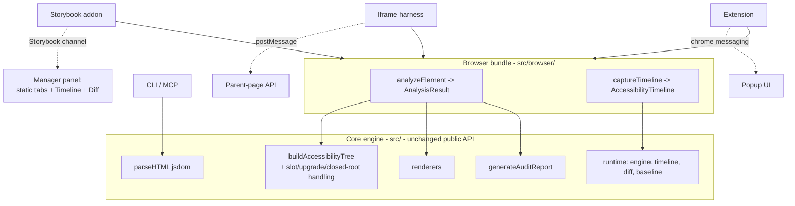
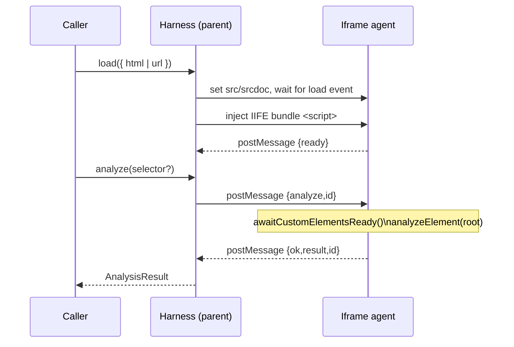
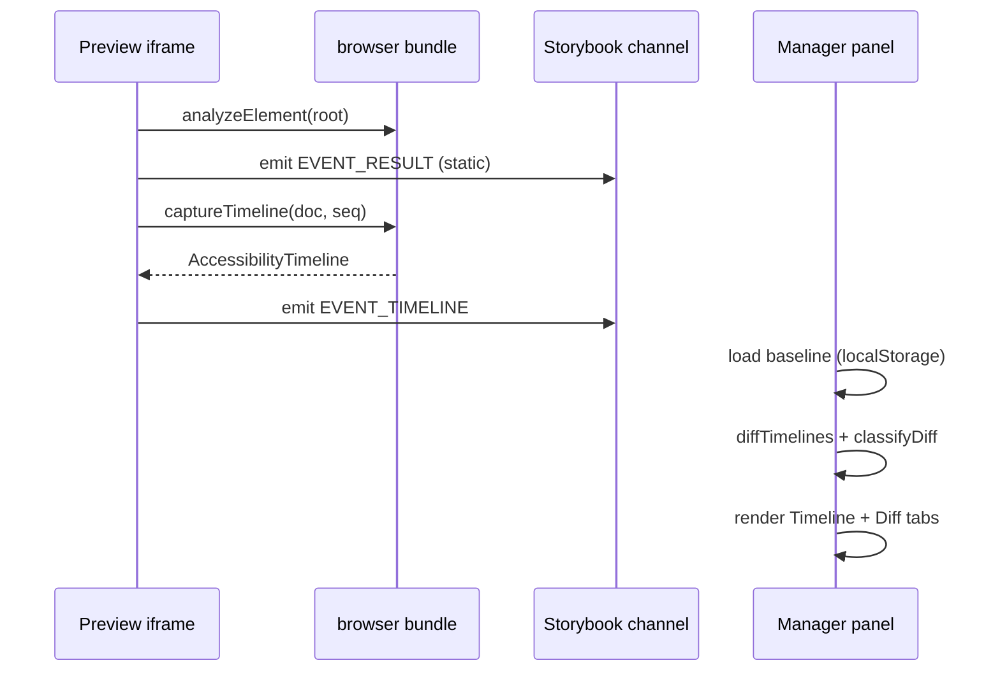

# Design Document

## Overview

This design expands AnnounceKit's runtime testing into a single, real-browser analysis engine surfaced across three consumers — the Storybook addon, a new standalone iframe harness, and the browser extension — with correct web-component/shadow-DOM support and interaction-timeline regression tooling.

The guiding principle is **one engine, many transports**. Today the core engine (`src/extractor`, `src/renderer`, `src/runtime`) is duplicated by the extension (`analyzer-bridge.js`) and only partially reached by the addon (static only). We introduce a transport-agnostic **browser bundle** that wraps the existing core engine, and adapt each surface to consume it over its own transport (Storybook channel, `postMessage`, or extension messaging). No surface reimplements analysis.

The four tracks map onto this as follows:

- **Track 2** builds the browser bundle (the shared foundation) and the iframe harness.
- **Track 3** improves the core engine's shadow-DOM/slot correctness, which every real-browser surface inherits for free.
- **Track 1** wires the existing `src/runtime` timeline + baseline + diff engine into the addon's preview/manager.
- **Track 4** retires `analyzer-bridge.js` in favor of the browser bundle.

### Goals

- Expose static analysis and interaction-timeline capture through a Storybook-independent browser bundle.
- Provide an iframe harness so any component (URL or HTML), including Lit web components, can be tested in a real browser.
- Correctly model slot projection, upgrade timing, and closed shadow roots.
- Make the extension, addon, and harness produce identical output for equivalent DOM.

### Non-Goals

- Replacing real screen-reader testing (output remains heuristic prediction).
- Changing the CLI/MCP behavior or the jsdom static path.
- Adding new screen-reader renderers.
- Full closed-shadow-root traversal (impossible by spec; we warn instead).

## Architecture

### Current state (before)



### Target state (after)



### Layering

1. **Core engine (`src/`)** — unchanged public API. Only internal shadow/slot logic in `src/extractor/tree-builder.ts` changes (Track 3). `analyzeDOM` currently living in `addon-speakable/src/analyzer.ts` moves down into the shared bundle.
2. **Browser bundle (`src/browser/`)** — new. Transport-agnostic. Exposes `analyzeElement` (static) and `captureTimeline` (interaction) plus an injectable IIFE entry for the harness/extension. Depends only on the core engine.
3. **Transports** — Storybook channel (addon), `postMessage` (harness), `chrome.runtime`/`chrome.tabs` (extension). Each transport marshals the same result shapes.

## Components and Interfaces

### 1. Browser bundle (`src/browser/`) — Track 2 foundation

New module directory. Two build outputs from the root `tsup.config.ts`: an ESM module (consumed by the addon and other bundlers) and an IIFE (`speakable-browser.global.js`, injectable into a page/iframe by the harness and extension).

**`src/browser/analyze.ts`** — static analysis, relocated and generalized from `addon-speakable/src/analyzer.ts`:

```ts
export interface AnalysisResult {
  nvda: string[]; jaws: string[]; voiceover: string[]; narrator: string[];
  audit: AuditFinding[];
  stats: { totalElements: number; interactiveElements: number; landmarks: number; headings: number };
  warnings: string[]; // NEW: surfaced tree-build warnings (closed shadow roots, upgrade timeouts)
}

/** Analyze a live DOM element using the core engine. Never throws on empty/detached input. */
export function analyzeElement(root: Element): AnalysisResult;
```

`analyzeElement` reuses `buildAccessibilityTree` + the four renderers + `generateAuditReport` exactly as `analyzeDOM` does today, and additionally maps `TreeBuildWarning[]` into `result.warnings` (Req 5.3). The addon's existing `analyzeDOM` becomes a thin re-export for compatibility.

**`src/browser/capture.ts`** — interaction capture, wrapping `src/runtime`:

```ts
export interface CaptureOptions {
  componentName: string;
  storyName?: string;
  sequence: InteractionSequence;      // from runtime types
  settlePeriod?: number;
  awaitUpgrade?: boolean;             // Track 3/Req 4 (default true)
  upgradeTimeoutMs?: number;
}

/** Attach the runtime engine to `document`, run the sequence, return a serializable timeline. */
export async function captureTimeline(
  document: Document,
  options: CaptureOptions
): Promise<AccessibilityTimeline>;
```

`captureTimeline` calls `awaitCustomElementsReady(document, ...)` (Track 3, below) then delegates to `createTimelineGenerator({ document, componentName, storyName, settlePeriod }).capture(sequence)`. This is a direct reuse of existing runtime code; the bundle only adds the browser entry and upgrade-await step.

**`src/browser/inject-entry.ts`** — IIFE entry that assigns `window.__SPEAKABLE__ = { analyzeElement, captureTimeline, version }`. Used when the code is injected into a foreign page/iframe (harness, extension).

### 2. Iframe harness (`src/harness/`) — Track 2

New module, distributed as part of the library, that runs in a **parent** page and controls an iframe. It is the Storybook-independent test surface.

```ts
export interface HarnessOptions {
  target: HTMLIFrameElement | { container: HTMLElement }; // reuse or create iframe
  timeoutMs?: number;            // load + inject timeout (Req 2.5)
  allowedOrigins?: string[];     // origin allowlist for postMessage (Req 2.4)
}

export interface Harness {
  /** Load a URL or an HTML string into the iframe and inject the bundle. */
  load(source: { url: string } | { html: string }): Promise<void>;
  /** Static analysis of the loaded document (optionally scoped by selector). */
  analyze(selector?: string): Promise<AnalysisResult>;
  /** Run an interaction sequence and return the timeline. */
  captureTimeline(options: CaptureOptions): Promise<AccessibilityTimeline>;
  destroy(): void;
}

export function createHarness(options: HarnessOptions): Harness;
```

**Injection & transport.** For same-origin content (`{ html }` via `srcdoc`, or same-origin URL), the harness injects the IIFE bundle by appending a `<script>` into the iframe document, then calls a small in-iframe agent. Communication uses `postMessage` with a request/response envelope:

```ts
type HarnessRequest =
  | { id: string; kind: 'analyze'; selector?: string }
  | { id: string; kind: 'capture'; options: SerializableCaptureOptions };
type HarnessResponse =
  | { id: string; ok: true; kind: 'analyze'; result: AnalysisResult }
  | { id: string; ok: true; kind: 'capture'; result: AccessibilityTimeline }
  | { id: string; ok: false; error: string };
```

The in-iframe agent (bundled with the IIFE) listens for `message` events, validates `event.origin` against `allowedOrigins` and `event.source === parent` (Req 2.4), dispatches to `window.__SPEAKABLE__`, and posts the response back. The parent side correlates by `id` and rejects on timeout (Req 2.5).

**Load flow (Req 2.1, 2.6):**



Cross-origin URLs cannot be script-injected; the harness detects this and rejects with a descriptive error recommending same-origin/`srcdoc` (Req 2.5). This constraint is documented rather than worked around.

### 3. Core engine shadow/slot correctness — Track 3

All changes are internal to `src/extractor/tree-builder.ts`; the public API (`buildAccessibilityTree`, `buildAccessibilityTreeWithSelector`) is unchanged.

**Slot projection (Req 3).** Today three sites iterate `element.shadowRoot.childNodes` then `element.childNodes` separately, which double-processes slotted nodes and misorders them. We centralize child collection into one helper and make it slot-aware:

```ts
function collectAccessibleChildren(element: Element, warnings): AccessibleNode[]
```

Behavior:
- If `element.shadowRoot` (open) exists, traverse the **shadow tree**; when a `<slot>` node is reached, resolve `slot.assignedNodes({ flatten: true })` and process those in place (Req 3.1, 3.2). If a slot has no assigned nodes, process the slot's default children (Req 3.3).
- Because slotted light-DOM nodes are emitted at their slot position, they are **not** also emitted from the host's light-DOM iteration (Req 3.4). Concretely: when a shadow root is present, we walk the shadow tree only, and slots pull in the light-DOM nodes; we do not separately walk `element.childNodes`.
- If no shadow root, behavior is the current light-DOM traversal (Req 3.5).

This replaces the shadow-then-light duplication in `collectChildrenFromRolelessElement`, `buildNodeRecursive`, and `createGenericContainer` with the single helper.

**Feature detection.** `assignedNodes` and `shadowRoot` are guarded so the jsdom path (limited shadow support) degrades gracefully — if `slot.assignedNodes` is unavailable, fall back to default content. This keeps the CLI path (Req 10.3) unaffected.

**Closed shadow roots (Req 5).** A closed root reports `element.shadowRoot === null` even though one exists; we cannot detect it directly in general. Where a component signals a closed root through a known convention (custom element with no accessible children but a defined tag), we emit a `TreeBuildWarning` noting possible hidden content. More reliably, the harness/addon capture side records an explicit warning when `customElements.get(tag)` is defined but the element exposes no `shadowRoot` and no light children (Req 5.1, 5.2). Warnings flow into `AnalysisResult.warnings` (Req 5.3). Traversal never throws.

**Upgrade timing (Req 4).** Lives in the browser bundle (needs a real browser), not the jsdom engine:

```ts
async function awaitCustomElementsReady(root: Document | Element, timeoutMs: number): Promise<UpgradeWarning[]>
```

- Collect custom-element tags (`localName` containing `-`) under `root`.
- For each, `await customElements.whenDefined(tag)` bounded by `timeoutMs` (Req 4.1, 4.4).
- For elements exposing an `updateComplete` promise (Lit), `await` it, also bounded (Req 4.2).
- On timeout, resolve anyway and return a warning per unresolved tag (Req 4.3). Warnings feed `AnalysisResult.warnings`.

### 4. Storybook addon timeline + baseline — Track 1

**Preview side (`addon-speakable/src/preview.ts`).** Keep the existing static `runAnalysis()` (Req 6.5, 10.2). Add timeline capture:

- Import `captureTimeline` from the browser bundle and `getBuiltinPattern` from runtime.
- Determine an interaction sequence for the current story from, in priority order: (a) a story parameter `parameters.speakable.sequence`, (b) the Storybook `play` function’s intent mapped to a sequence, or (c) a selected built-in pattern (Req 6.2). If none, skip timeline capture and emit static only (Req 6.5).
- On story render, after static analysis, run `captureTimeline(document, { componentName, storyName, sequence })` and emit the timeline over a new channel event `EVENT_TIMELINE`.
- Detach/reset between stories: the timeline generator attaches and detaches its own engine per capture, and we guard against overlapping captures by aborting an in-flight generator on story change (Req 6.6).

**Baseline + diff.** Because the preview iframe cannot write to disk, baselines are stored via a small storage abstraction with a browser implementation:

```ts
interface PanelBaselineStore {
  key(component: string, story: string): string;
  save(component: string, story: string, timeline: AccessibilityTimeline): Promise<void>;
  load(component: string, story: string): Promise<AccessibilityTimeline | null>;
}
```

- Browser implementation persists to `localStorage`/`IndexedDB` keyed by a stable `component::story` key (Req 7.1, 7.6). The existing `createBaselineStorage` (fs-based) is reused for CLI/CI, not the panel.
- When a story with a stored baseline is captured, the manager computes `diffTimelines(baseline, current)` then `classifyDiff(...)` (Req 7.2, 7.3) and emits an `EVENT_DIFF` result.
- Diff is computed in the manager (it already receives serialized timelines) to keep the preview lean.

**Channel events (`addon-speakable/src/index.ts`).** Add `EVENT_TIMELINE = 'speakable/timeline'` and `EVENT_DIFF = 'speakable/diff'` alongside the existing `EVENT_RESULT`.

**Manager side (`addon-speakable/src/manager.tsx`).** Add two tabs to the existing tab bar:

- **Timeline** — renders `AccessibilityTimeline.events` chronologically: timestamp, event type, target role/name, and payload summary (focus moved, live-region text, dialog open/close, state change) (Req 6.4). Includes a "Set baseline" button that persists the current timeline (Req 7.1) and a "No baseline yet" hint when none exists (Req 7.5).
- **Diff** — renders the `ClassifiedDiffReport`: added/removed/changed entries with severity coloring (Req 7.4).

Existing NVDA/JAWS/VoiceOver/Narrator/Audit tabs are untouched (Req 10.2).



### 5. Extension unification — Track 4

- Add an IIFE build output of the browser bundle to the extension (`extension/vendor/speakable-browser.global.js`) via `extension/build.sh`.
- `content.js` currently returns page HTML. Change it to run analysis against the **live DOM** in the page context: inject/import the bundle and call `window.__SPEAKABLE__.analyzeElement(document.documentElement)` (or a selector-scoped element), returning `AnalysisResult` (Req 8.1, 8.2, 8.3). This captures JS-set state and open shadow roots that the string round-trip lost.
- `popup.js` consumes the returned `AnalysisResult` directly instead of calling the old `SpeakableAnalyzer.analyze`.
- `analyzer-bridge.js` is removed; if any popup code still references `window.SpeakableAnalyzer`, replace it with a thin adapter over the bundle (Req 8.5). Output now matches the core engine by construction (Req 8.4, 9.1).

## Data Models

Existing types are reused unchanged:

- `AnalysisResult`, `AuditFinding` — from `addon-speakable/src/analyzer.ts`, moved to `src/browser/analyze.ts`; extended with `warnings: string[]`.
- `AccessibilityTimeline`, `AccessibilityEvent`, `InteractionSequence`, `InteractionAction` — from `src/runtime/types.ts`.
- `BehaviorDiffReport`, `ClassifiedDiffReport`, `SeverityLevel` — from `src/runtime/diff-engine.ts` / `severity.ts`.
- `BaselineFile`, `BaselineStorage` — from `src/runtime/baseline-storage.ts` (fs) reused for CLI/CI; a new browser `PanelBaselineStore` for the panel.

New types: `HarnessOptions`, `Harness`, `HarnessRequest`, `HarnessResponse`, `CaptureOptions`, `UpgradeWarning`, `PanelBaselineStore`.

## Build & Packaging

Root `tsup.config.ts` gains two entries:

```ts
// ESM module for bundler consumers (addon imports this)
{ entry: { 'browser/index': 'src/browser/index.ts' }, format: ['esm'], platform: 'browser', dts: true, clean: false }
// IIFE for injection into pages/iframes (harness, extension)
{ entry: { 'speakable-browser.global': 'src/browser/inject-entry.ts' }, format: ['iife'], globalName: 'SpeakableBrowser', platform: 'browser', clean: false }
```

- `package.json` `exports` adds `"./browser"` → `./dist/browser/index.js`.
- `build:addon` continues to copy the addon dist into `dist/storybook`; the addon now imports from the shared browser module rather than reaching into `../../src` for analysis (Req 1.3, 9.2).
- `extension/build.sh` copies the IIFE output into `extension/vendor/` (Req 8.1).
- Existing `build`, `build:addon`, CLI/MCP outputs remain (Req 10.1, 10.3).

## Error Handling

- `analyzeElement` returns a well-formed empty result for empty/detached input instead of throwing (Req 1.6), mirroring `buildAccessibilityTree`'s hidden-root handling.
- Harness `load`/`analyze`/`captureTimeline` reject with descriptive errors on load failure, injection failure, cross-origin injection, or timeout (Req 2.5); every request is timeout-bounded.
- `postMessage` handlers validate origin (`allowedOrigins`) and source before acting; malformed messages are ignored (Req 2.4).
- Shadow/slot traversal never throws; unresolvable cases (closed roots, missing `assignedNodes`, upgrade timeouts) become warnings (Req 4.3, 5.1, 5.2).
- Timeline capture aborts cleanly on story change, detaching observers to avoid leaks (Req 6.6).

## Testing Strategy

- **Core engine (Track 3):** unit tests in the existing vitest suite for slot ordering, default slot content, no-double-emit, and no-slot fallback, using a real-DOM environment (jsdom with shadow shims or `@web/test-runner`-style DOM). Closed-root and no-slot regression tests to confirm existing behavior (Req 3.5, 10.4).
- **Browser bundle:** unit tests for `analyzeElement` parity with existing `analyzeDOM` output on shared fixtures (Req 9.1), and `captureTimeline` producing a timeline for a scripted sequence.
- **Upgrade timing:** tests with a stub custom element whose `whenDefined`/`updateComplete` resolve late, asserting analysis waits and that a timeout yields a warning (Req 4.1–4.4).
- **Harness:** tests using an in-DOM iframe with `srcdoc`, asserting request/response correlation, origin rejection, and timeout behavior (Req 2.2–2.5).
- **Addon:** tests for channel events (`EVENT_TIMELINE`, `EVENT_DIFF`), the sequence-resolution priority, and baseline set/load/diff via the browser store (Req 6, 7). Static-tab behavior regression (Req 10.2).
- **Extension:** test that `content.js` returns an `AnalysisResult` from live DOM including shadow content, and that output matches the core engine for a shared fixture (Req 8.2–8.4, 9.1).
- **Consistency (Req 9):** a shared fixture set analyzed through the bundle, addon path, and extension path asserts identical per-reader announcements.

## Sequencing / Migration Notes

Recommended implementation order (matches dependency direction): browser bundle (Track 2 foundation) → shadow/slot + upgrade correctness (Track 3) → iframe harness (Track 2) → addon timeline/baseline (Track 1) → extension unification (Track 4) → cross-surface consistency tests. Each track is independently shippable, and the static addon/CLI paths keep working throughout (Req 10).
