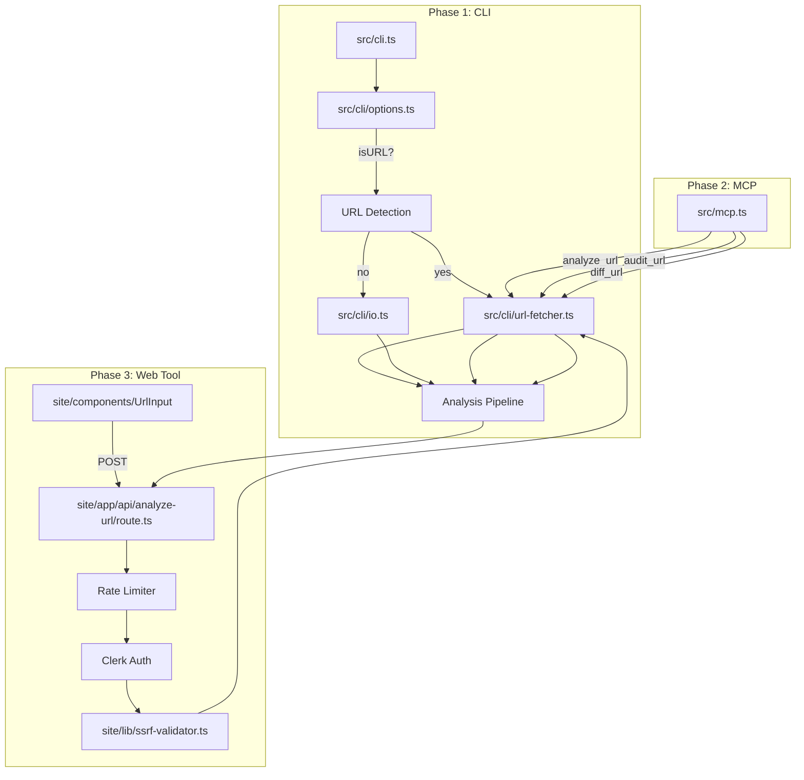
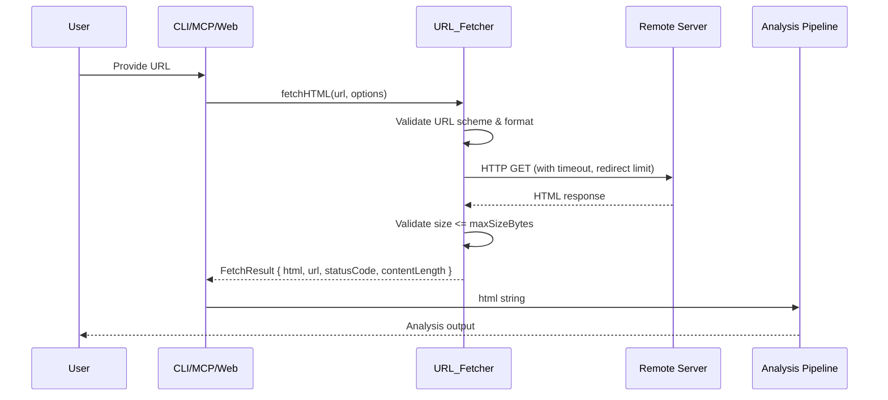

# Design Document: URL Analysis

## Overview

URL Analysis extends the Speakable accessibility analysis pipeline to accept live URLs as input, fetching page HTML over HTTP and routing it through the existing parsing, tree-building, and rendering stages. The feature is delivered in three independent phases:

1. **Phase 1 — CLI URL Fetch**: The CLI auto-detects URL arguments and fetches HTML before analysis. Zero security risk (runs locally).
2. **Phase 2 — MCP Server URL Support**: The MCP server exposes `analyze_url`, `audit_url`, and `diff_url` tools that reuse the same fetcher. Low risk (AI assistant context).
3. **Phase 3 — Web Tool URL Input**: A server-side API route with SSRF validation, rate limiting, and authentication wraps the shared fetcher for public use.

A single shared `URL_Fetcher` module provides the core fetch logic used by all three phases. Phase 3 adds a separate `SSRF_Validator` module that wraps the fetcher with security checks appropriate for a public-facing server.

**Key design decisions:**
- Node.js native `fetch()` — no new dependencies
- Pure async function interface for testability
- Reuse of existing `MAX_INPUT_SIZE` (10 MB) from the parser
- URL detection via protocol prefix matching, not regex patterns
- Phased delivery allows each phase to ship independently

## Architecture



### Data Flow



## Components and Interfaces

### URL_Fetcher Module

**Path:** `src/cli/url-fetcher.ts`

The core fetch module — a pure async function with no side effects beyond the network request. Used by CLI, MCP, and web tool.

```typescript
/**
 * Options for URL fetching.
 */
export interface FetchOptions {
  /** Request timeout in milliseconds. Default: 10000 */
  timeoutMs: number;
  /** Maximum number of redirects to follow. Default: 5 */
  maxRedirects: number;
  /** Maximum response body size in bytes. Default: 10 * 1024 * 1024 (10 MB) */
  maxSizeBytes: number;
}

/**
 * Result of a successful URL fetch.
 */
export interface FetchResult {
  /** The fetched HTML content */
  html: string;
  /** Final URL after redirects (may differ from input) */
  url: string;
  /** HTTP status code of the final response */
  statusCode: number;
  /** Content length in bytes */
  contentLength: number;
}

/**
 * Error thrown when URL fetching fails.
 */
export class URLFetchError extends Error {
  constructor(
    message: string,
    public readonly code: 'INVALID_URL' | 'UNSUPPORTED_SCHEME' | 'TIMEOUT' |
                          'HTTP_ERROR' | 'SIZE_EXCEEDED' | 'REDIRECT_LIMIT' | 'NETWORK_ERROR',
    public readonly url: string,
    public readonly statusCode?: number
  ) {
    super(message);
    this.name = 'URLFetchError';
  }
}

/** Default fetch options */
export const DEFAULT_FETCH_OPTIONS: FetchOptions = {
  timeoutMs: 10_000,
  maxRedirects: 5,
  maxSizeBytes: 10 * 1024 * 1024, // 10 MB — matches MAX_INPUT_SIZE in html-parser.ts
};

/**
 * Fetches HTML content from a URL.
 *
 * @param url - The URL to fetch
 * @param options - Fetch options (uses defaults if not provided)
 * @returns FetchResult on success
 * @throws URLFetchError on any failure
 */
export async function fetchHTML(
  url: string,
  options?: Partial<FetchOptions>
): Promise<FetchResult>;
```

### URL Detection (in options.ts)

A pure function added to `src/cli/options.ts`:

```typescript
/**
 * Determines if an input string is a URL.
 * Returns true if the string starts with "http://" or "https://".
 */
export function isURL(input: string): boolean;
```

The `ParsedInput` type is extended:

```typescript
export interface ParsedInput {
  input?: string;
  isStdin: boolean;
  isURL: boolean;       // NEW: true if input was detected as a URL
  inputs?: string[];
  inputTypes?: Array<'file' | 'url'>; // NEW: type of each batch input
}
```

### SSRF_Validator Module (Phase 3)

**Path:** `site/lib/ssrf-validator.ts`

Wraps URL fetching with IP validation for the web tool's server-side route.

```typescript
/**
 * Private IP ranges that SSRF validator blocks.
 */
export const PRIVATE_IP_RANGES: Array<{ network: string; prefix: number }>;

/**
 * Validates that a URL does not resolve to a private IP address.
 * Performs DNS resolution and checks against blocklist.
 *
 * @param url - URL to validate
 * @returns Resolved IP address if public
 * @throws SSRFError if URL resolves to private/internal IP
 */
export async function validateURL(url: string): Promise<string>;

/**
 * Fetches HTML with SSRF protection.
 * Resolves DNS, validates IP, then fetches with the shared URL_Fetcher.
 * Performs double-resolution to prevent DNS rebinding.
 *
 * @param url - URL to fetch
 * @param options - Fetch options
 * @returns FetchResult on success
 * @throws SSRFError if IP is private at any point
 * @throws URLFetchError for other fetch failures
 */
export async function fetchHTMLSafe(
  url: string,
  options?: Partial<FetchOptions>
): Promise<FetchResult>;

/**
 * Checks if an IP address is in a private/reserved range.
 */
export function isPrivateIP(ip: string): boolean;

export class SSRFError extends Error {
  constructor(message: string, public readonly url: string) {
    super(message);
    this.name = 'SSRFError';
  }
}
```

### API Route (Phase 3)

**Path:** `site/app/api/analyze-url/route.ts`

```typescript
// POST /api/analyze-url
// Body: { url: string, screenReader?: string, selector?: string, format?: string }
// Returns: { result: AnalysisOutput } or { error: string }
// Auth: Required (Clerk)
// Rate limit: 10 req/min per user
```

## Data Models

### FetchOptions

| Field | Type | Default | Description |
|-------|------|---------|-------------|
| `timeoutMs` | `number` | `10000` | Abort fetch after this duration |
| `maxRedirects` | `number` | `5` | Maximum redirect hops |
| `maxSizeBytes` | `number` | `10485760` | Maximum response body bytes |

### FetchResult

| Field | Type | Description |
|-------|------|-------------|
| `html` | `string` | Raw HTML content of the page |
| `url` | `string` | Final URL after following redirects |
| `statusCode` | `number` | HTTP status of the final response |
| `contentLength` | `number` | Byte length of the response body |

### URLFetchError Codes

| Code | Trigger | CLI Exit Code |
|------|---------|---------------|
| `INVALID_URL` | URL cannot be parsed by `new URL()` | 1 |
| `UNSUPPORTED_SCHEME` | Scheme is not `http` or `https` | 1 |
| `TIMEOUT` | Request exceeds `timeoutMs` | 3 |
| `HTTP_ERROR` | Response status is not 2xx | 3 |
| `SIZE_EXCEEDED` | Body exceeds `maxSizeBytes` | 2 |
| `REDIRECT_LIMIT` | More than `maxRedirects` hops | 3 |
| `NETWORK_ERROR` | DNS failure, connection refused, etc. | 3 |

### JS-Warning Threshold

When the fetched HTML `<body>` contains fewer than 100 characters of visible text, emit a warning:
> "Page may require JavaScript to render content. URL analysis retrieves static HTML only."

## Correctness Properties

*A property is a characteristic or behavior that should hold true across all valid executions of a system — essentially, a formal statement about what the system should do. Properties serve as the bridge between human-readable specifications and machine-verifiable correctness guarantees.*

### Property 1: URL Classification Biconditional

*For any* input string, it is classified as a URL if and only if it starts with `http://` or `https://` (case-insensitive protocol prefix). All other strings are classified as file paths.

**Validates: Requirements 1.1, 1.2**

### Property 2: Non-2xx Status Error Reporting

*For any* HTTP response with a non-2xx status code, the URL_Fetcher SHALL throw a `URLFetchError` with code `HTTP_ERROR` whose message contains both the numeric status code and the original URL.

**Validates: Requirements 2.2**

### Property 3: Redirect Following Within Limit

*For any* redirect chain of length N where 1 ≤ N ≤ maxRedirects, the URL_Fetcher SHALL follow all redirects and return the content and final URL from the last response.

**Validates: Requirements 2.5**

### Property 4: Private IP Rejection

*For any* IP address in the ranges 127.0.0.0/8, 10.0.0.0/8, 172.16.0.0/12, 192.168.0.0/16, or ::1, the `isPrivateIP` function SHALL return `true` and the SSRF_Validator SHALL reject the request with a 403 status.

**Validates: Requirements 6.2**

### Property 5: Private IP Rejection on Redirect Targets

*For any* redirect chain where any intermediate target resolves to a private IP address, the SSRF_Validator SHALL reject the request before following that redirect, regardless of the position of the private IP in the chain.

**Validates: Requirements 6.3**

### Property 6: No Raw HTML in API Response

*For any* successful URL analysis via the `/api/analyze-url` endpoint, the JSON response SHALL NOT contain the raw HTML string that was fetched from the URL.

**Validates: Requirements 6.5**

### Property 7: JS-Dependent Page Warning Threshold

*For any* fetched HTML where the `<body>` element contains fewer than 100 characters of visible text content, the analysis pipeline SHALL emit a warning about potential JavaScript dependency. When visible text is 100 characters or more, no such warning SHALL be emitted.

**Validates: Requirements 9.2**

### Property 8: Unsupported Scheme Rejection

*For any* URL with a scheme other than `http` or `https` (e.g., `ftp://`, `file://`, `data:`, `javascript:`), the URL_Fetcher SHALL throw a `URLFetchError` with code `UNSUPPORTED_SCHEME`.

**Validates: Requirements 10.1**

### Property 9: Malformed URL Rejection

*For any* string that cannot be parsed as a valid URL by the `URL` constructor, the URL_Fetcher SHALL throw a `URLFetchError` with code `INVALID_URL`.

**Validates: Requirements 10.2**

## Error Handling

### URL_Fetcher Error Strategy

The fetcher uses a typed error hierarchy with machine-readable codes:

| Scenario | Error Type | Recovery |
|----------|-----------|----------|
| Malformed URL | `URLFetchError('INVALID_URL')` | User fixes input |
| Non-HTTP scheme | `URLFetchError('UNSUPPORTED_SCHEME')` | User fixes input |
| Timeout (10s) | `URLFetchError('TIMEOUT')` | User retries or uses file |
| HTTP 4xx/5xx | `URLFetchError('HTTP_ERROR')` | User checks URL availability |
| Response > 10 MB | `URLFetchError('SIZE_EXCEEDED')` | User uses --selector or file input |
| > 5 redirects | `URLFetchError('REDIRECT_LIMIT')` | User provides final URL |
| DNS/network failure | `URLFetchError('NETWORK_ERROR')` | User checks connectivity |

### CLI Error Mapping

```typescript
function mapFetchErrorToExitCode(error: URLFetchError): number {
  switch (error.code) {
    case 'INVALID_URL':
    case 'UNSUPPORTED_SCHEME':
      return 1; // User error (bad input)
    case 'SIZE_EXCEEDED':
      return 2; // Content error
    case 'TIMEOUT':
    case 'HTTP_ERROR':
    case 'REDIRECT_LIMIT':
    case 'NETWORK_ERROR':
      return 3; // System/network error
  }
}
```

### MCP Error Mapping

MCP tools return `{ isError: true, content: [{ type: 'text', text: message }] }` for all fetch failures. The message includes the error code and URL for debuggability.

### Web Tool Error Mapping

| URLFetchError Code | HTTP Status | User Message |
|--------------------|-------------|--------------|
| `INVALID_URL` | 400 | "Invalid URL format" |
| `UNSUPPORTED_SCHEME` | 400 | "Only http:// and https:// URLs are supported" |
| `TIMEOUT` | 504 | "The page took too long to respond" |
| `HTTP_ERROR` | 502 | "The page returned an error (HTTP {status})" |
| `SIZE_EXCEEDED` | 413 | "The page is too large to analyze (max 10 MB)" |
| `REDIRECT_LIMIT` | 400 | "Too many redirects" |
| `NETWORK_ERROR` | 502 | "Could not reach the page" |
| `SSRFError` | 403 | "URL resolves to a private address" |

### Timeout Implementation

```typescript
// Using AbortController with Node.js native fetch
const controller = new AbortController();
const timeout = setTimeout(() => controller.abort(), options.timeoutMs);

try {
  const response = await fetch(url, {
    signal: controller.signal,
    redirect: 'manual', // Handle redirects manually for counting
  });
  // ...
} finally {
  clearTimeout(timeout);
}
```

### Size Limit Enforcement

Size is checked in two ways:
1. **Content-Length header** — reject immediately if reported size exceeds limit
2. **Streaming body read** — track bytes read and abort if accumulated size exceeds limit

This prevents both honest large responses and responses without Content-Length from consuming excessive memory.

### Redirect Handling

Redirects are followed manually (using `redirect: 'manual'`) to:
- Count redirect hops against `maxRedirects`
- Validate each redirect target's IP in Phase 3 SSRF mode
- Track the final URL for `FetchResult.url`

## Testing Strategy

### Unit Tests (vitest)

Unit tests cover specific examples and edge cases:
- URL detection with various inputs (http://, https://, relative paths, edge cases)
- Error message formatting for each error code
- CLI exit code mapping
- `isPrivateIP` with boundary IPs (172.15.255.255 = public, 172.16.0.0 = private)
- Integration of URL path with existing flags

### Property-Based Tests (fast-check + vitest)

Property-based tests verify universal correctness properties using the `fast-check` library already in devDependencies. Each property test runs a minimum of 100 iterations.

**Configuration:**
- Library: `fast-check` (already installed)
- Runner: `vitest`
- Min iterations: 100 per property
- Tag format: `Feature: url-analysis, Property {N}: {description}`

**Properties to test:**
1. URL classification biconditional (Property 1)
2. Non-2xx error reporting includes status + URL (Property 2)
3. Redirect chains within limit succeed (Property 3)
4. Private IP rejection for all private ranges (Property 4)
5. Private IP rejection at any redirect position (Property 5)
6. API response excludes raw HTML (Property 6)
7. JS-warning threshold at 100 chars (Property 7)
8. Non-http/https schemes rejected (Property 8)
9. Malformed URLs rejected (Property 9)

### Integration Tests

- End-to-end CLI test with a local HTTP server (using Node.js `http.createServer`)
- MCP tool registration and invocation tests
- Web API route tests with mocked fetch and Clerk auth

### Test Organization

```
tests/
  url-fetcher.test.ts          # Unit + property tests for fetchHTML
  url-fetcher.property.test.ts # Property-based tests (Properties 2, 3, 8, 9)
  url-detection.test.ts        # Unit + property tests for isURL (Property 1)
  ssrf-validator.test.ts       # Unit + property tests for SSRF (Properties 4, 5)
  js-warning.test.ts           # Property test for warning threshold (Property 7)
  cli-url-integration.test.ts  # Integration tests for CLI + URL
  mcp-url-tools.test.ts        # Integration tests for MCP tools
site/__tests__/
  analyze-url-route.test.ts    # API route tests (Property 6 + examples)
```
